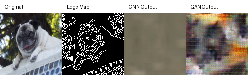

# Edge-Conditioned Pet Image Reconstruction

**A PyTorch image-to-image translation pipeline that reconstructs pet images from Canny edge maps using a CNN baseline and a GAN-based generator.**

_Live demo note: this app is hosted on the free tier of Streamlit and may take around 30 to 60 seconds to wake up on the first visit._

**Live Demo:** [pet-image-reconstruction-drslg5zlv4c3m2tbjkaynl.streamlit.app](https://pet-image-reconstruction-drslg5zlv4c3m2tbjkaynl.streamlit.app/)

## Project Snapshot

| Category | Details |
| --- | --- |
| Task | Edge-to-image pet reconstruction |
| Dataset | Oxford-IIIT Pet Dataset |
| Input | OpenCV Canny edge map |
| Output | Reconstructed RGB pet image |
| Models | CNN encoder-decoder baseline, conditional GAN |
| Deployment | Streamlit web app and CLI demo |
| Stack | PyTorch, torchvision, OpenCV, Streamlit, NumPy, Pillow, Matplotlib |

## Problem Statement

This project explores whether sparse structural information from an edge map can be translated back into a realistic pet image. The CNN baseline learns a deterministic reconstruction from edge input to RGB output, while the GAN adds adversarial training to improve perceptual realism and recover sharper pet-like texture details.

The result is a compact image-to-image translation system that compares traditional reconstruction against generative modeling in a reproducible, demo-ready application.

## Technical Approach & Design Decisions

### Data Pipeline

- Loads images from the Oxford-IIIT Pet dataset with `torchvision`.
- Resizes images to `128x128` for lightweight local training and deployment.
- Converts RGB pet images into 3-channel Canny edge maps using OpenCV.
- Uses edge maps as model inputs and original RGB images as reconstruction targets.
- Includes a blurred-edge mode in the Streamlit app to demonstrate domain shift.

### CNN Baseline

- Implements a simple convolutional encoder-decoder in `src/models/cnn.py`.
- Trains with L1 reconstruction loss.
- Establishes a baseline for coarse shape and color reconstruction.
- Tends to produce smoother outputs because it optimizes pixel-level similarity directly.

### GAN Model

- Implements a generator and discriminator in `src/models/gan.py`.
- The generator reconstructs RGB pet images from Canny edge maps.
- The discriminator evaluates paired edge-image inputs.
- Training combines adversarial loss with L1 reconstruction loss, encouraging outputs that are both structurally aligned and visually more realistic.

## Architecture

```text
Input Pet Image
      |
      v
OpenCV Canny Edge Extraction
      |
      v
Edge Map
      |
      +------> CNN Baseline ------> CNN Reconstruction
      |
      +------> GAN Generator -----> GAN Reconstruction
                         |
                         v
                Visual Comparison + Saved Artifacts
```

## Live Demo

The Streamlit app provides an interactive interface for running pretrained inference.

Features:

- Upload a custom pet image.
- Run inference on included sample images.
- Compare standard and blurred edge inputs.
- View GAN-focused results with an optional CNN baseline comparison.
- Save generated original, edge, CNN, GAN, and comparison artifacts locally.

**Live app:** [pet-image-reconstruction-drslg5zlv4c3m2tbjkaynl.streamlit.app](https://pet-image-reconstruction-drslg5zlv4c3m2tbjkaynl.streamlit.app/)

## Quick Start

Clone the repository:

```bash
git clone https://github.com/adityavats2/pet-image-reconstruction.git
cd pet-image-reconstruction
```

Install dependencies:

```bash
pip install -r requirements.txt
```

Run pretrained CLI inference:

```bash
python demo.py --image sample_inputs/pug_1.jpg
```

Run the Streamlit app locally:

```bash
streamlit run app.py
```

Train the CNN baseline:

```bash
python train_cnn.py
```

Train the GAN:

```bash
python train_gan.py
```

Evaluate saved checkpoints:

```bash
python evaluate.py
```

Pretrained CNN and GAN checkpoints are included in `checkpoints/` for immediate inference.

## Project Structure

```text
.
├── app.py                  # Streamlit web application
├── demo.py                 # CLI inference demo
├── evaluate.py             # Evaluation and visual comparison
├── train_cnn.py            # CNN training entry point
├── train_gan.py            # GAN training entry point
├── assets/                 # README images and visual proof
├── checkpoints/            # Pretrained CNN and GAN weights
├── sample_inputs/          # Demo-ready pet images
├── notebooks/              # Original research and development notebook
└── src/
    ├── config.py           # Shared experiment settings
    ├── data/               # Dataset loading and preprocessing
    ├── models/             # CNN and GAN architectures
    ├── training/           # Training loops
    ├── inference/          # Reusable inference pipeline
    ├── evaluation/         # Metrics and visualization
    └── utils/              # Device, paths, and reproducibility helpers
```

## Results

The CNN baseline captures the broad silhouette and color distribution of the input pet image, but its outputs are often smoother because the model is optimized directly against pixel-level reconstruction loss.

The GAN output is designed to improve perceptual quality by using a discriminator during training. In practice, this encourages more realistic local texture and sharper pet-like details compared with the CNN baseline.

The included visual comparison shows the full inference path:

```text
Original Image -> Canny Edge Map -> CNN Output -> GAN Output
```



## Engineering Highlights

- Refactored a monolithic Colab notebook into a portable Python project.
- Separated data loading, preprocessing, model definitions, training, evaluation, inference, and utility code into reusable modules.
- Added checkpoint-based inference for reproducible demos without retraining.
- Built both a CLI workflow and a public-facing Streamlit application.
- Included sample inputs so reviewers can run inference immediately.
- Added CPU-compatible inference for accessible local and hosted demos.
- Preserved the original notebook as research context while promoting production-facing code into `src/`.

## Limitations and Future Work

- Current models operate at `128x128` resolution to keep training and deployment lightweight.
- Evaluation currently emphasizes L1 loss and qualitative visual comparison.
- Future evaluation could add SSIM, PSNR, LPIPS, or FID for richer image-quality analysis.
- The GAN architecture is intentionally compact for portability; future versions could use U-Net, Pix2Pix, perceptual loss, or higher-resolution training.
- Free-tier Streamlit hosting may introduce cold starts on first load.

## Capstone Summary

This project began as a university coursework notebook and was refactored into a portable ML application with modular PyTorch code, pretrained checkpoints, CLI inference, and a deployed Streamlit demo. The final system demonstrates both computer vision modeling and the engineering work required to turn a research prototype into a usable product demo.
